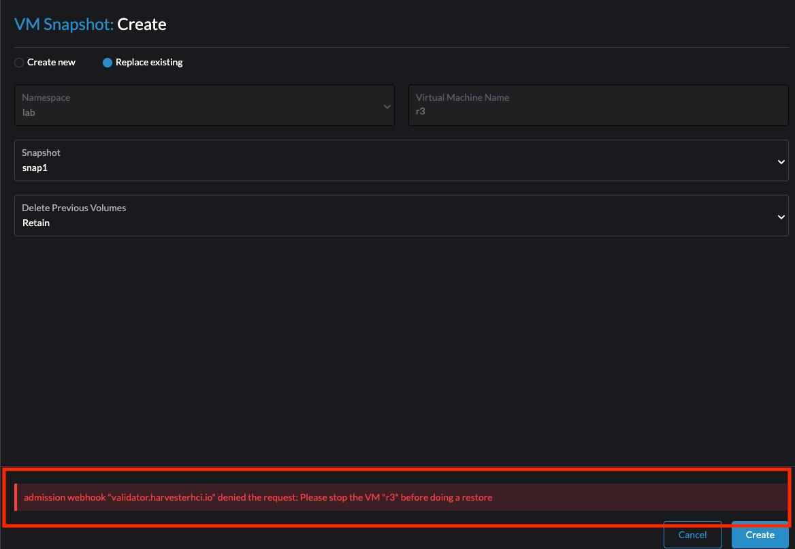
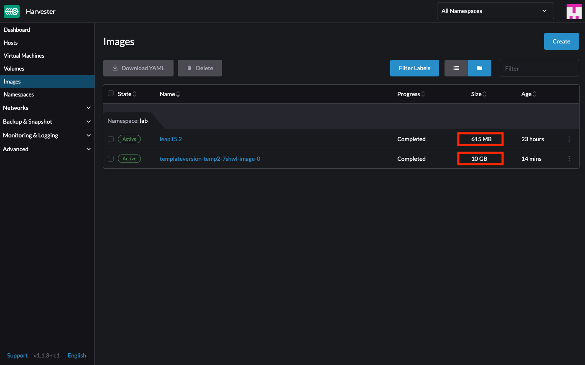
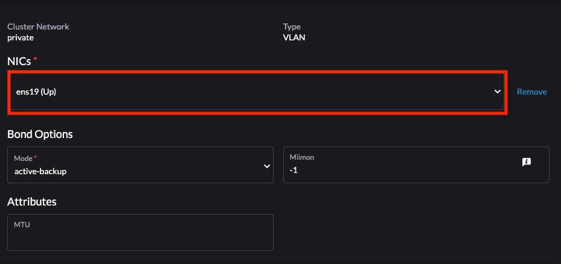
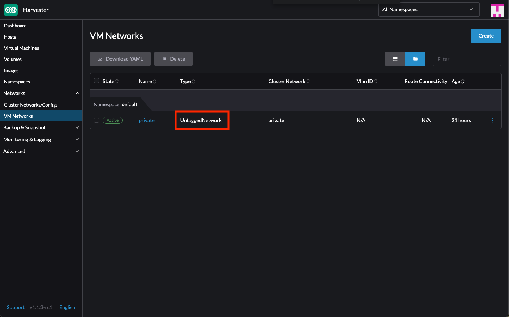
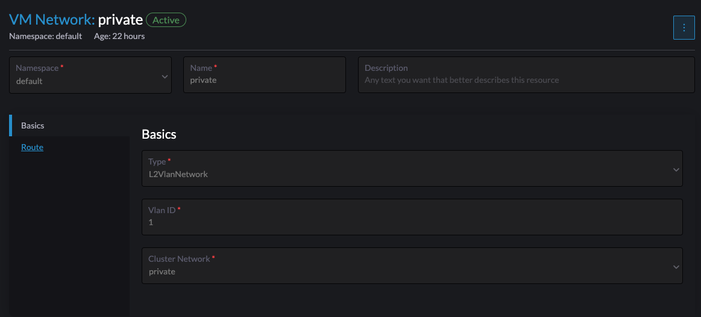
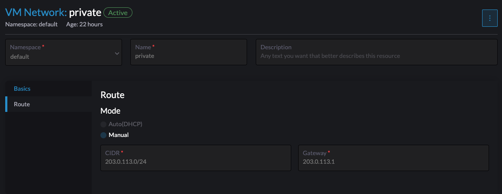
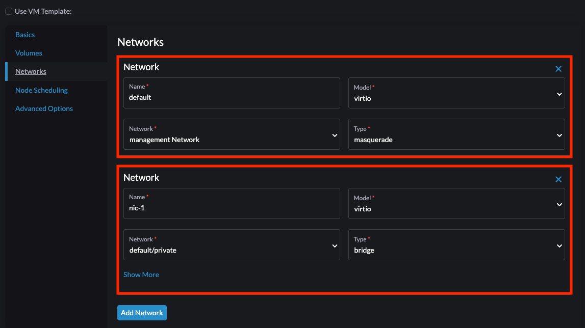
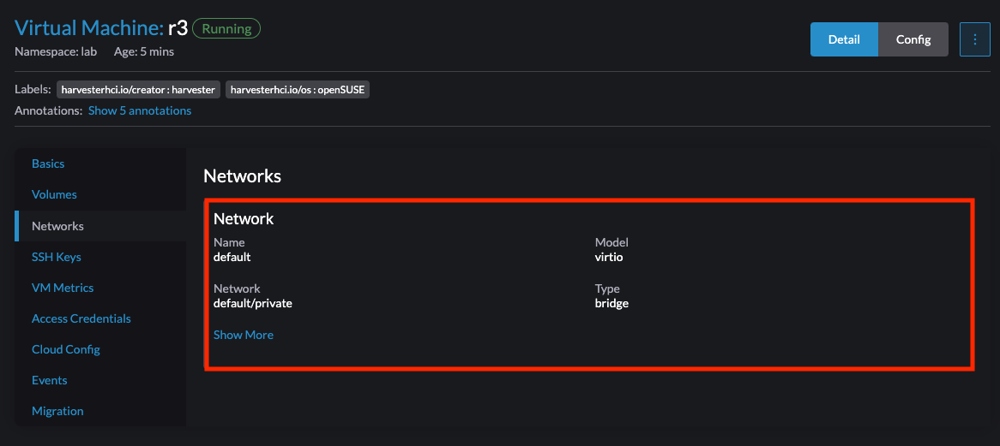

## Drawbacks and Challenges

### High Resource Requirements in Harvester

When initiating Harvester, the system immediately demands significant resources, utilizing at least 10GB of RAM and 4 CPUs. This level of resource usage is notably high, especially when compared to other hypervisors (eg: xen, vmware).

The official [hardware requirements](https://docs.harvesterhci.io/v1.2/install/requirements#hardware-requirements) are even higher:

- CPU: min: 8-core; prefer: 16 cores or more
- Memory: min 32 GB; prefer: 64 GB or more
- Disk Capacity: min 140 GB; prefer: 500 GB or more

This high demand for resources can largely be attributed to Harvester's underlying architecture, which is based on a Kubernetes cluster.

### Operational Limitations in VM Management

Tasks like
- modifying network settings
- recovering VM snapshots

require stopping the VM first, which can be a significant limitation in certain scenarios.



### Large File Sizes for Exported Templates

The size of exported templates in Harvester is directly proportional to the VM size. This can result in unexpectedly large file sizes for templates. 

For example, when starting with an original cloud image of 1GB and creating a VM with a 10GB disk, the resulting template size was also 10GB, significantly larger than the original image size.



### Space Issue in default paritition setup

One notable storage issue in Harvester is the often insufficient default size of the `/usr/local` partition, particularly when it comes to system upgrades.

To address this, a workaround has been provided through a script available on GitHub. 

This script is designed to purge unused images, thereby freeing up valuable space in the `/usr/local` partition. This solution is detailed in [Harvester Issue #2668](https://github.com/harvester/harvester/issues/2668).

### Rancher is lagging behind the k8s Releases

Rancher serves as a management platform for various clusters and operates independently of Harvester.

For installation, Rancher offers options to use either Helm or Docker. 

While the Docker installation method is effective, there have been challenges with installations on the latest k8s versions. 

Rancher does not support the most recent k8s versions. For instance, as detailed in the [Rancher v2.7.9](https://github.com/rancher/rancher/releases/tag/v2.7.9), the latest supported Kubernetes version is v1.26.9, whereas the Kubernetes has already advanced to version v1.28.

## Capabilities

In terms of technology, Harvester incorporates several advanced features:

- RKE2 Integration: Harvester employs RKE2, which is similar to k3s but includes additional CIS hardening features for improved security.
- Multus for Networking: The use of Multus in Harvester enhances its networking capabilities, allowing for the configuration of multiple networks within the system.
- KubeVirt for VM Management: Harvester integrates KubeVirt, enabling the creation of VMs using KVM within containers.

### Network Management

- The default network in Harvester is the Management Network, also known as the pod network.
- Harvester supports the creation of custom networks, enabling users to set up cluster networks (binding to the NIC) and VM networks (configuring subnets and VLANs) for tailored network configurations.
- The platform includes features for assigning custom MAC addresses and managing multiple networks.

```
|--machine (ens19)
|--harvester (ens19)
|----vm (management network; vm network `private` that bond to ens19)
```

My network setup involves configuring a virtual machine (VM) with two network interface cards (NICs). The first NIC is connected to the Management Network, and the second NIC is linked to a secondary network card on Harvester (eth19). This configuration allows an external machine to connect to the VM on the same network.

I have also tested a setup with secondary network only. In this arrangement, there is connectivity between the VM and a machine on the same network, along with internet access.

This represents the cluster network setup. Multiple NICs can be chosen.


This illustrates the VM network setup with an untagged network.


show the VM network setup with type VLAN, but the VLAN ID is set to 1



For 2Nic Test,



network-config
```yaml
network:
  version: 1
  config:
    - type: physical
      name: eth0
      subnets:
        - type: dhcp
    - type: physical
      name: eth1
      subnets:
        - type: static
          address: 203.0.113.3/24
```

For 1Nic Test



network-config 
```yaml
network:
  version: 1
  config:
    - type: physical
      name: eth0
      subnets:
        - type: static
          address: 203.0.113.3/24
```

### Virtual Machine Management

- Creating VMs using cloud image and cloud-init.
- Accessing VMs is possible both through the Harvester host and from external.
- Adding extra disk to a VM, can be done while the VM is running.
- Adding or changing network connections, the VM needs to be stopped before making these changes.
- Taking snapshots of VMs.
- Managing multiple network interfaces, including setting up second NICs and assigning mac address.
- Supports backup options to external storage locations like S3 and NFS.
- The restore functionality provides flexibility to create new VMs or replace existing ones from backups and snapshots.
